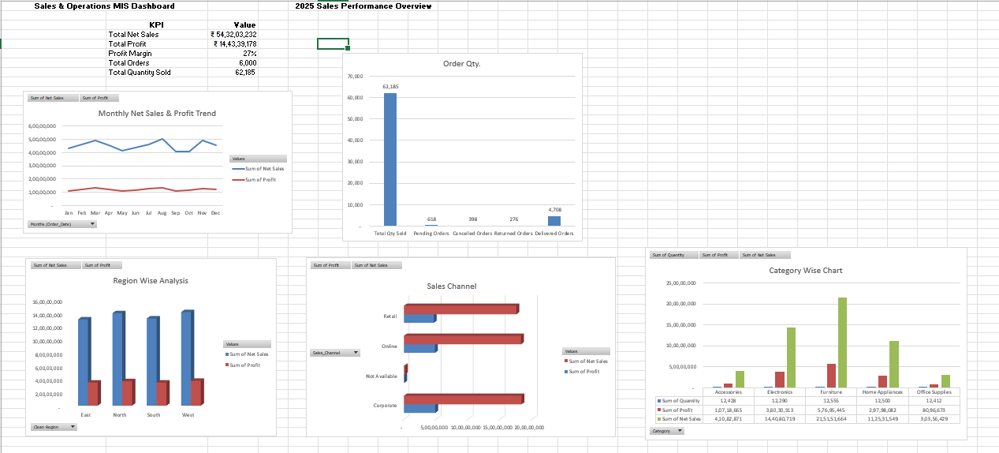
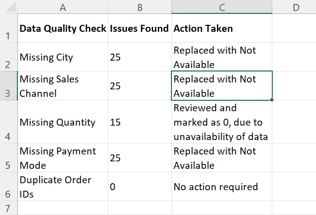
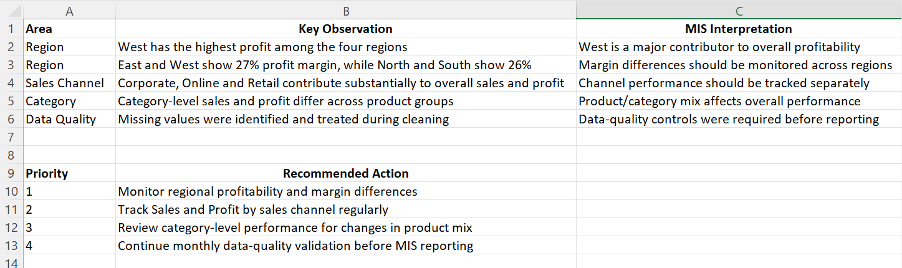

# Sales & Operations MIS Reporting Dashboard

An Excel-based Sales & Operations MIS project focused on data cleaning, KPI reporting, PivotTable analysis, profitability analysis, data quality checks, and management dashboarding.

## Project Overview

This project demonstrates how raw sales transaction data can be transformed into a structured MIS reporting solution using Microsoft Excel.

The workbook includes data cleaning, calculated business metrics, KPI reporting, regional and sales-channel analysis, category-level analysis, data-quality validation, and an interactive management dashboard.

## Business Objective

The objective of this project is to provide management with a clear view of:

- Overall sales performance
- Profitability and profit margin
- Regional performance
- Sales channel performance
- Category performance
- Order and transaction-level information
- Data quality issues requiring attention

## Dataset

The cleaned dataset contains 6,000 sales records with fields covering:

- Order information
- Region
- State and City
- Sales Channel
- Customer Segment
- Product and Category
- Quantity
- Unit Price
- Discount Rate
- Cost
- Order Status
- Payment Mode
- Revenue
- Discount
- Net Sales
- Profit
- Profit Margin

## Data Cleaning & Preparation

The raw data was reviewed and prepared for MIS reporting by:

- Identifying missing and inconsistent values
- Standardizing data fields
- Validating numerical and categorical columns
- Handling missing values using `Not Available` where appropriate
- Treating unavailable quantitative values consistently for analysis
- Creating calculated business metrics
- Checking data consistency before building reports and dashboards

## Key KPIs

The project tracks the following key performance indicators:

- Total Net Sales
- Total Profit
- Overall Profit Margin
- Number of Sales Records
- Regional Sales Performance
- Regional Profitability
- Sales Channel Performance
- Category Performance

## Analysis Performed

### 1. Region-wise Analysis

Analyzed Net Sales, Profit, and Profit Margin across:

- East
- North
- South
- West

### 2. Sales Channel Analysis

Compared sales and profitability across available sales channels and separately retained `Not Available` records where the source data did not contain a sales channel.

### 3. Category-wise Analysis

Analyzed sales and profitability across product categories to identify differences in contribution and performance.

### 4. Profitability Analysis

Calculated Profit Margin to evaluate profitability relative to Net Sales.

**Profit Margin = Profit / Net Sales**

## Dashboard

The final dashboard brings the key MIS metrics and visual analysis together in a single reporting view.



## Data Quality

A separate data-quality review was included to identify missing or inconsistent information and document how those records were treated before analysis.



## Management Insights

The analysis was converted into management-oriented observations to demonstrate how MIS reporting can support business review and decision-making.



## Tools & Skills Demonstrated

- Microsoft Excel
- Excel Tables
- Excel Formulas
- Data Cleaning
- Data Validation
- PivotTables
- KPI Reporting
- Profitability Analysis
- MIS Reporting
- Dashboard Development
- Data Quality Checks
- Business Analysis
- Management Reporting

## Project Structure

```text
Sales-Operations-MIS
│
├── README.md
├── Sales_Operations_Project.xlsx
├── Dashboard.png
├── Data_Quality.png
└── Management_Insights.png
